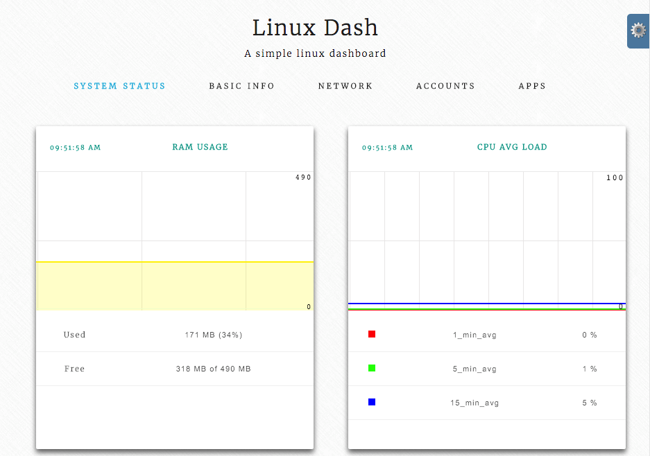
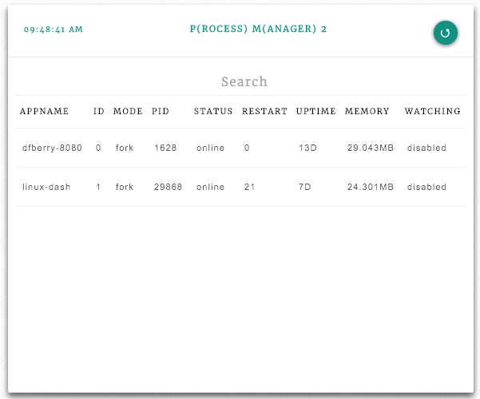
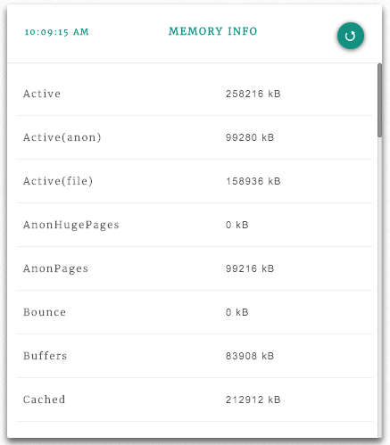

#Adding pm2 status to linux-dash

##linux-dash
[linux-dash](https://github.com/afaqurk/linux-dash) is a light-weight, open-source web dashboard to monitor your linux machine or virtual machine. You can find this package on [Github](https://github.com/afaqurk/linux-dash). 



The dashboard reports many different aspects of our linux installation via shell scripts (*.sh). This allows the dashboard to be light-weight, and work on most linux machines. The website displays running charts, and tables. The web site can be node, php, or go. For the node webserver, the only dependencies are express and websocket. 

##Extending linux-dash
You may have a few extra services or programs running on your linux installation that you would like to display on linux-dash . I use [pm2](http://pm2.keymetrics.io/), a process manager. Adding a table to display the pm2 status information was very easy -- even if you are not familiar with client-side Angular directives or server-side Node.JS or server-side shell scripts. 

The naming convention and templating allows us to focus on the few components we need to build without struggling on the glue between them. 

##pm2 Dashboard Design
The 'pm2 list' command shows a table with information on the command line. 

```
┌──────────────┬────┬──────┬───────┬────────┬─────────┬────────┬─────────────┬──────────┐
│ App name     │ id │ mode │ pid   │ status │ restart │ uptime │ memory      │ watching │
├──────────────┼────┼──────┼───────┼────────┼─────────┼────────┼─────────────┼──────────┤
│ dfberry-8080 │ 0  │ fork │ 1628  │ online │ 0       │ 12D    │ 27.113 MB   │ disabled │
│ linux-dash   │ 1  │ fork │ 29868 │ online │ 21      │ 7D     │ 20.270 MB   │ disabled │
└──────────────┴────┴──────┴───────┴────────┴─────────┴────────┴─────────────┴──────────┘
 Use `pm2 show <id|name>` to get more details about an app
```

We want to show this in the linux-dash website on the applications tab in its own table. 



In order to do that, we need:

1. a new shell script - to capture the results of running "pm2 list" and return json
2. changes to glue - to find script and display as table

I'll discuss each piece.

##Installing linux-dash
If you do not have linux-dash installed, you will need to get it. Clone it from [github](https://github.com/afaqurk/linux-dash). Make sure scripts have execute status and the webserver is started with SUDO privileges. 

##Writing the server-side Shell script 
This section applies to services with a snapshot or single point in time.  

If you have not written a shell script before, no need to worry. There are plenty of examples of shell scripts at /server/modules/shell_files. The final output of the shell script needs to either be an empty json object such as {} or an array of values such as [{},{},{}]. The values will be key/value pairs (1 key, 1 value) which will diplay as a 2xn grid of information.



The second choice is a table (array of key/value pairs) with more columns which is what we need.

  
###pm2 list output
The command I usually run at the command line is "pm2 list" -- the response shows each process with uptime, status, and other information in a table. 

```
1 ┌──────────────┬────┬──────┬───────┬────────┬─────────┬────────┬─────────────┬──────────┐
2 │ App name     │ id │ mode │ pid   │ status │ restart │ uptime │ memory      │ watching │
3 ├──────────────┼────┼──────┼───────┼────────┼─────────┼────────┼─────────────┼──────────┤
4 │ dfberry-8080 │ 0  │ fork │ 1628  │ online │ 0       │ 12D    │ 27.113 MB   │ disabled │
5 │ linux-dash   │ 1  │ fork │ 29868 │ online │ 21      │ 7D     │ 20.270 MB   │ disabled │
6 └──────────────┴────┴──────┴───────┴────────┴─────────┴────────┴─────────────┴──────────┘
7  Use `pm2 show <id|name>` to get more details about an app
```
We need to know which lines to ignore (1-3, 6, 7) and which to include (only 4 and 5). 

Make sure each line of your output is accounted for as either ignored or parsed. While I ignored the header and footer, perhaps your data should be included. 

The shell script needs to be able to read each row into a meaningful json object such as:
```
[  
   {  
      "appName":"dfberry-8080",
      "id":"0",
      "mode":"fork",
      "pid":"1628",
      "status":"online",
      "restart":"0",
      "uptime":"13D",
      "memory":"20.043MB",
      "watching":"disabled"
   },
   {  
      "appName":"linux-dash",
      "id":"1",
      "mode":"fork",
      "pid":"29868",
      "status":"online",
      "restart":"21",
      "uptime":"7D",
      "memory":"28.293MB",
      "watching":"disabled"
   }
]
```
##pm2.sh
The script has 3 sections. The first section sets the command to the variable 'command'. The second section executes the command and sets the returned text (the command line table) to the variable 'data'. The third section is in two sections. The first section (a) executes if the 'data' variable has any length. The second section (b) returns an empty json object if the 'data' variable is empty.

Most of the work is in section 3.a with the 'awk' command. The first line pipes the 'data' variable through tail, only passing lines 4 or greater to the next pipe which is head. Head takes all the lines except the last 2 and pipes the results to awk.

The rest of 3.a is working through each column of each row, getting the values $6 means the sixth column. Columns include column break characters of '|' so make sure to include them in the count. 

If you are watching the trailing commas, you may be wondering how the last one is removed.  Bash has [a couple of different ways](http://unix.stackexchange.com/questions/144298/delete-the-last-character-of-a-string-using-string-manipulation-in-shell-script), I'm using the older bash version syntax which is ${t%?}.  

```
#!/bin/bash

#1: set text of command
command="pm2 list"

#2: execute command
data="$($command)"

#3: only process data if variable has a length 
#this should handle cases where pm2 is not installed
if [ -n "$data" ]; then
	
	#a: start processing data on line 4
	#don't process last 2 lines
	json=$( echo "$data" | tail -n +4 | head -n +2 \
	| awk 	'{print "{"}\
		{print "\"appName\":\"" $2 "\","} \
		{print "\"id\":\"" $4 "\","} \
		{print "\"mode\":\"" $6 "\","} \
		{print "\"pid\":\"" $8 "\","}\
		{print "\"status\":\"" $10 "\","}\
		{print "\"restart\":\"" $12 "\","}\
		{print "\"uptime\":\"" $14 "\","}\
		{print "\"memory\":\"" $16 $17 "\","}\
		{print "\"watching\":\"" $19 "\""}\
		{print "},"}')
	#make sure to remove last comma and print in array
	echo "[" ${json%?} "]"
else
	#b: no data found so return empty json object
	echo "{}"
fi
```

Make sure the script has execute permissions then try it out on your favorite linux OS. If you have pm2 installed and running, you should get a json object filled in with values.    
At this point, you are done with the server-side code. Isn't that amazing? 

###Naming conventions
The client-side piece of the code is connected to the server-side script via the naming convention. I called this script pm2.sh on the server in the server/modules/shell_files directory. For the client-side/Angular files, you need to use the same name or Angular version of the same name.  

##Client-side changes for Angular
The Angular directive will be pm2 and used like:
```
<pm2></pm2>
```
    
Add this to the /templates/sections/applications.html so that the entire file looks like:

```
<common-applications></common-applications>
<memcached></memcached>
<redis></redis>
<pm2></pm2>
```   
    
Since the pm2 directive is at the end, it will display as the last table. Notice I haven't actually built a table in html, css, or any other method. I just added a directive using a naming convention tied to the server-side script. Pretty cool, huh?

###Routing to the new Angular directive
The last piece is to route the directive 'pm2' to a call to the server for the 'pm2.sh' script.  

In the /js/modules.js file, the routing for simple tables in controlled by the 'simpleTableModules' variable. Find that section. We need to add a new json object to the array of name/template sections. 

```
{
    name: 'pm2',
    template: '<table-data heading="P(rocess) M(anager) 2" module-name="pm2" info="pm2 read-out."></table-data>'
}, 
``` 
It doesn't matter where in the array the section is added, just that the naming convention is used. Notice the name is 'pm2' and the template.module-name is set to the same value of 'pm2'. 

If I wanted a simple table of 2 columns instead of 9 columns, the json object would look like:

```
{
    name: 'pm2',
    template: '<key-value-list heading="P(rocess) M(anager) 2" module-name="pm2" info="pm2 read-out."></key-value-list>'
},
```   
The key-value-list changes the html display to a 2xN column table.     

##Summary
With very little code, you can add reports to linux-dash. You need to write a shell script with execute permissions that outputs a json object for the server-side. For the client-side you need to create a directive via adding its syntax to the appropriate section template. Then add a route to the modules.js file. The biggest piece of work is getting the shell script to work. 

Now that you know how to create new reporting tables for linux-dash, feel free to add your own code to the project via a pull request. 